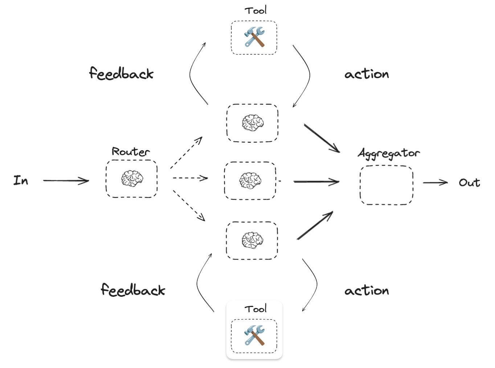

# Explorer AI - Multi-Agent Conversational Interface

A modern, interactive AI chat application featuring multiple specialized agents with distinct personalities, powered by LangGraph and Next.js.

## Features

### Multi-Agent System
- **Explorer Agent**: An adventurous guide with a passion for discovery and storytelling, leading users through their journey of exploration.
- **Weather Agent**: A weather expert with a sarcastic sense of humor, providing weather information with a witty twist.
- **News Agent**: A sarcastic news reporter delivering current events with a distinctive personality.

### Interactive Interface
- 🎙️ Voice Input: Natural speech-to-text conversion for hands-free interaction
- 🔊 Text-to-Speech: Listen to agent responses with voice synthesis
- 💬 Real-time Chat: Fluid conversation experience with markdown support
- 📝 Message History: Track and review your conversation history
- 🔄 Auto-summarization: Get concise summaries of your conversations

### User Experience
- 🎨 Modern UI with explorer theme
- 🌓 Consistent design language
- 📱 Responsive layout
- ⚡ Real-time interactions
- 🔐 Secure authentication

## Technologies

### Frontend
- **Next.js 14**: App Router, Server Components
- **React**: Hooks, Context
- **Tailwind CSS**: Styling and animations
- **TypeScript**: Type safety
- **Web Speech API**: Voice input/output capabilities
- **Heroicons**: UI icons
- **Google Fonts**: Playfair Display, Quicksand

### Backend
- **Next.js API Routes**: Backend API
- **LangGraph**: Multi-agent orchestration
- **LangChain**: LLM interactions
- **Authentication**: Session-based auth

### Development
- **ESLint**: Code quality
- **Prettier**: Code formatting
- **TypeScript**: Static typing
- **Git**: Version control

## LangGraph Workflow



The application uses LangGraph to orchestrate a multi-agent system with parallel processing capabilities. The architecture follows a Router-Agents-Aggregator pattern:

### Agent Design
- **Router Agent**: Analyzes user input and determines which specialized agent(s) should handle the request
- **Specialized Agents**:
  - Weather Agent: Handles weather-related queries with real-time data
  - News Agent: Processes news-related requests with current events
  - General Agent: Manages general knowledge and conversation
- **Communication**: Agents operate independently and in parallel when multiple are selected

### Graph Structure
- **Nodes**:
  - Router Node: Entry point that analyzes and routes requests
  - Agent Nodes: Specialized processing units (Weather, News, General)
  - Aggregator Node: Combines multiple agent responses
- **Edges**:
  - START → Router: Initial request analysis
  - Router → Agent(s): Conditional routing based on content
  - Agent(s) → Aggregator: Response collection
  - Aggregator → END: Final response formation

### State Management
- **Graph State**:
  - input: User's message
  - decision: Selected agents for processing
  - outputs: Individual agent responses
  - combinedOutputs: Aggregated final response
- **Agent State**:
  - Every agent can read and access
  - Includes conversation history

### Integration Points
- **Frontend Communication**:
  - Next.js API routes for request handling
  - Real-time response streaming
  - WebSocket for continuous updates
- **External Connections**:
  - OpenAI API for LLM processing
  - Weather API for real-time weather data
  - News API for current events
- **Error Handling**:
  - Graceful degradation on agent failures
  - Fallback to general agent when specialized services fail
  - Request validation and sanitization

## Getting Started

1. Clone the repository:
```bash
git clone [repository-url]
```

2. Install dependencies:
```bash
npm install
```

3. Set up environment variables:
```bash
cp .env.example .env.local
```

4. Run the development server:
```bash
npm run dev
```

5. Open [http://localhost:3000](http://localhost:3000) in your browser.

## Environment Variables

```env
NEXT_PUBLIC_SUPABASE_URL=your-key-goes-here
NEXT_PUBLIC_SUPABASE_ANON_KEY=your-key-goes-here

OPENAI_API_KEY=your-key-goes-here

OPENWEATHER_API_KEY=your-key-goes-here
NEWS_API_KEY=your-key-goes-here

LANGCHAIN_API_KEY=your-key-goes-here
LANGCHAIN_API_URL=your-key-goes-here
LANGCHAIN_TRACING_V2=your-key-goes-here
LANGCHAIN_PROJECT=your-key-goes-here
LANGCHAIN_ENDPOINT=your-key-goes-here
```

## Contributing

1. Fork the repository
2. Create your feature branch
3. Commit your changes
4. Push to the branch
5. Create a new Pull Request
